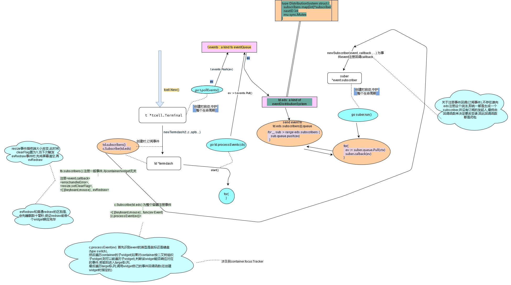

# [Go] 可交互动态终端 <1, 事件注册分发中心>

[github.com/mum4k/termdash](https://github.com/mum4k/termdash)

如何完成一个好看的terminal呢?在以前我们大都会使用简单的printf来打印数据到终端,进阶一点,可能会加上颜色,再后来可能又做个贪吃蛇游戏,了解了如何高效刷新terminal......

我们先来看看该库的Feature List

- Full support for terminal window resizing throughout the infrastructure.
- Customizable layout, widget placement, borders, margins, padding, colors, etc.
- Dynamic layout changes at runtime.
- Binary tree and Grid forms of setting up the layout.
- Focusable containers and widgets.
- Processing of keyboard and mouse events.
- Periodic and event driven screen redraw.
- A library of widgets, see below.
- UTF-8 for all text elements.
- Drawing primitives (Go functions) for widget development with character and sub-character resolution.

这些Feature,就是要学习的地方

计划阅读学习的部分:

1. 事件注册分发系统
2. 终端事件轮询器
3. 基于cell的终端结构体
4. 容器二叉树
5. 容器focusTracker
6. 布局
7. 鼠标事件之有限状态机
8. segmentDisplay 类似于七段数码管的display模式

## 1. 事件注册分发系统eventDistributionSystem(eds)

依赖于事件监听第三方库: tcell "github.com/gdamore/tcell/v2"

针对每个订阅,都启动一个go程轮询自己,看自己的事件队列是否为空,不为空则消费

> 用更go的style,这里应该使用channel,而不是用 `链表+sync.cond+sync.Mutex`

可以认为订阅没有发起者,只是一个个平行同一的item,当事件触发后,调用订阅的回调函数,该函数一般是闭包函数,由此改变逻辑上的订阅发起者

## update2021/3/14
今天在看消息队列的时候,了解到,原来这个事件分发中心的设计模式是`观察者模式`
> 消息队列的特性: 异步解耦削峰
## 下一章

就像netpoller网络事件轮询器一样,要实现可交互终端,我们需要终端事件轮询器